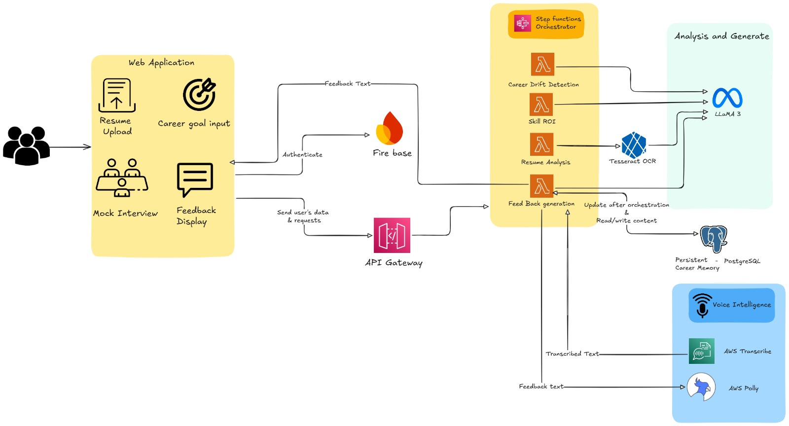
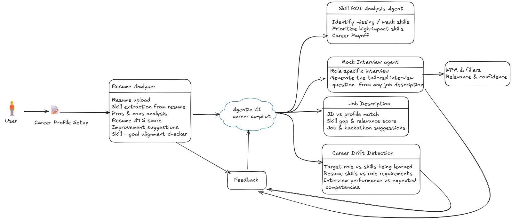
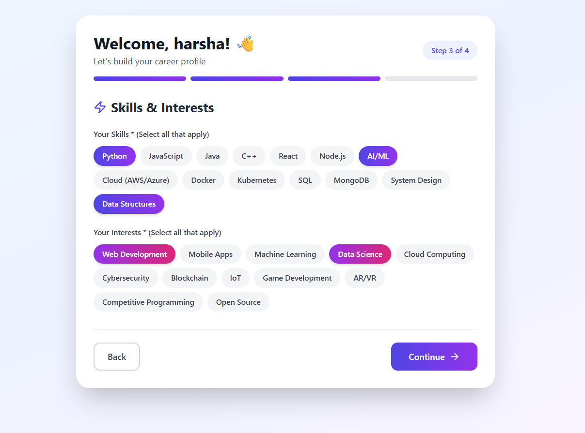
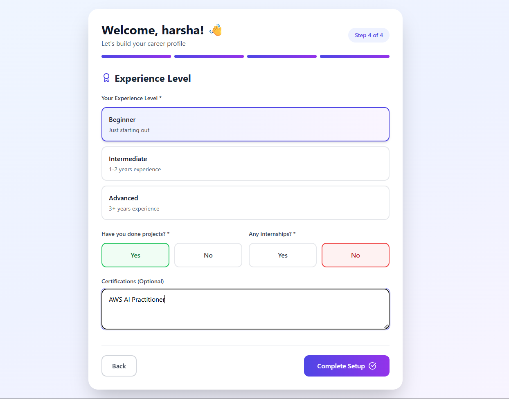
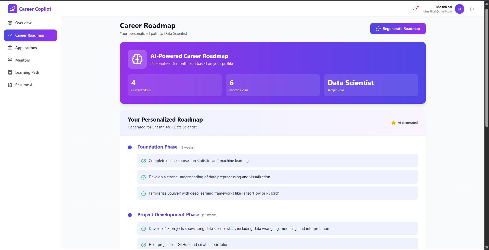
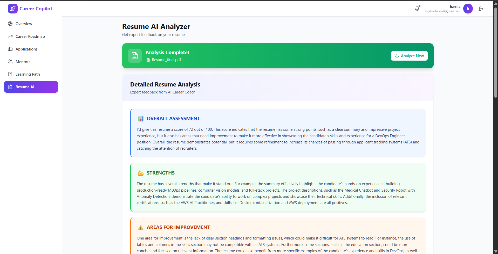

# 🚀 Career Copilot - AI-Powered Career Development Assistant

**Track:** Agentic AI  
**Team:** 200 OK  

---

## 💡 Project Idea / Overview

**The Problem:**  
Students and early-career professionals struggle to make clear career decisions due to scattered guidance, unclear skill priorities, and lack of interview readiness. Current platforms don't provide continuous mentorship, personalized skill prioritization, or realistic interview feedback.

**Our Solution:**  
Career Copilot is an **Agentic AI-powered career development platform** that acts as your personal career mentor. It goes beyond traditional career guidance by:

- 🧠 **Continuously analyzing** your resume, skills, interests, and career goals
- 🎯 **Reasoning about** job market needs and role feasibility  
- 📊 **Planning skill roadmaps** using our unique **Skill ROI framework** (prioritizing skills with highest career payoff)
- 🎤 **Conducting voice-based mock interviews** with real-time speech analytics
- 🔍 **Detecting career drift** to identify and correct misaligned learning paths early
- 🚀 **Actively recommending** jobs, internships, and hackathons tailored to your profile

**From Career Confusion → Job Readiness**

---

## 🌟 Key Features

### 👤 Comprehensive Profile Building
- Capture detailed user information: skills, interests, experience, and career goals
- Build a holistic profile that forms the foundation for all AI recommendations
- One-time setup that powers personalized career guidance throughout the platform

### 📄 AI-Powered Resume Analysis
- **Not just basic PDF parsing** — intelligent scoring system that evaluates your resume
- Provides detailed **pros and cons** based on YOUR specific skills and interests
- Contextual feedback aligned with your career profile and target roles
- Identifies gaps between your resume and your stated goals

### 🗺️ Personalized AI Career Roadmap
- Generates customized learning paths based on **your unique profile**
- Roadmap adapts to your skills, interests, experience level, and career aspirations
- Step-by-step guidance on what to learn, when to learn it, and why it matters
- Smart skill prioritization based on your individual career trajectory

### 🤖 Agentic AI Career Assistant 
- Maintains persistent career memory across sessions
- Autonomously plans, acts, and adapts based on your progress
- Analyzes resume and continuously updates career strategy

### 📈 Skill ROI-Based Reasoning Engine 
- Evaluates skill demand, learning effort, and career payoff
- Determines realistic career paths and skill priorities
- Focuses on skills with the highest return on investment

### 🎙️ Voice-Based AI Interview Practice 
- Simulates role-specific interviews with voice-to-voice interaction
- Speech analytics: WPM, filler words, pauses, clarity, confidence
- Measures response relevance and identifies skill gaps
- Provides actionable feedback for improvement

### 🛤️ Career Drift Detection 
- Continuously monitors learning and interview performance
- Detects misaligned career progress early
- Corrects trajectory before you invest time in wrong skills

---

## 🏗️ Architecture Diagram

### Technology Stack

| Module / Purpose | Technology Used |
|-----------------|-----------------|
| Agent Orchestration | AWS Step Functions |
| Voice - Speech to Text | Amazon Transcribe |
| Voice - Text to Speech | Amazon Polly |
| Interview Q&A Generation |  Llama 3 |
| Persistent Career Memory | PostgreSQL |
| Agent Execution | AWS Lambda |
| Frontend | React + TailwindCSS |
| Resume Text Ingestion | Tesseract OCR |
| API Gateway | AWS API Gateway |

---

## 🔄 User Flow

The system follows an intelligent workflow:
1. **Resume Analysis** → Upload and extract skills, experience, interests
2. **Career Assessment** → AI analyzes career goals and current position
3. **Skill ROI Calculation** → Prioritizes high-impact skills
4. **Personalized Roadmap** → Generates learning path
5. **Mock Interviews** → Practice with voice-based AI interviewer
6. **Continuous Monitoring** → Track progress and detect drift
7. **Opportunity Matching** → Receive relevant job/internship recommendations

---

## 🎯 Our Unique Value Proposition (USP)

✅ **Skill ROI-based learning** — Not all skills are equal; we prioritize what matters most  
✅ **Persistent AI agents** — Your career copilot remembers everything and evolves with you  
✅ **Voice-to-Voice interviews** — Practice like it's real, with speech analytics feedback  
✅ **Career drift detection** — Catch misaligned learning before it's too late  
✅ **One-stop platform** — Resume analysis, skill planning, interview prep, and job matching in one place

---

## 🚧 Project Status

### ✅ Implemented Features:

  
  

  
  

- **Frontend UI** - React-based user interface with TailwindCSS
- **Profile Building System** - User onboarding with skills, interests, and experience collection
- **AI Resume Analysis** - Intelligent scoring with pros/cons based on user profile
- **AI Career Roadmap Generator** - Personalized learning paths tailored to individual profiles

### 🔜 Upcoming Features:
- Agentic AI system with persistent memory
- Skill ROI calculation engine
- Voice-based mock interviews with speech analytics
- Career drift detection mechanism
- Job/internship recommendation system

---

## 👥 Team - 200 OK

- Y Bhasith Sai Reddy (Team Leader)
- CB Harsha Vardhan
- C Vishnuvardhan Chowdary
- I Charuhas Reddy

